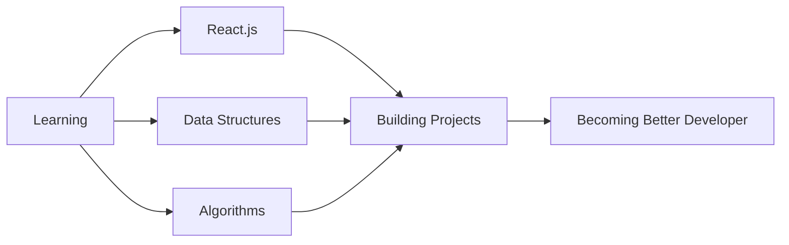

<div align="center">
  
</div>

<div align="center">
  
</div>

<br/>


## 💫 About Me

```javascript
const osama = {
    location: "Cairo, Egypt 🇪🇬",
    education: "FCAI - Cairo University",
    interests: ["Software Development", "Problem Solving", "Web Technologies"],
    currentlyLearning: ["React", "Advanced Algorithms", "System Design"],
    funFact: "I debug with console.log() and I'm proud of it! 😄",
    askMeAbout: ["C++", "Web Dev", "Competitive Programming"]
};
```

<br/>

- 🎓 Studying **Computer Science** at **FCAI-CU**
- 💡 Passionate about building **elegant solutions** to complex problems
- 🌱 Currently diving deep into **React** and **Modern Web Development**
- 🎯 Goal: Become a **Full-Stack Developer**
- 📫 Reach me at **oa8253707@gmail.com**
- ⚡ Fun fact: **Coffee + Code = ❤️**

<br clear="both"/>

---

## 🛠️ Tech Stack & Tools

<div align="center">

### Languages


### Frameworks & Libraries


### Tools & Technologies


</div>

---

## 📊 GitHub Analytics

<div align="center">
  
  
</div>

<div align="center">
  
</div>

<div align="center">
  
</div>

---

## 🏆 GitHub Trophies

<div align="center">
  
</div>

---

## 🎯 Current Focus



---

## 💼 Featured Projects

<div align="center">
  <a href="https://github.com/osama-ahmmad?tab=repositories">
    
  </a>
</div>

<br/>

> 🚀 Check out my repositories to see what I'm building!

---

## 🌐 Connect With Me

<div align="center">
  
[](mailto:oa8253707@gmail.com)
[](https://www.linkedin.com/in/osama-ahmed-7502a8357)
[](https://www.instagram.com/usama_ahmed02/)
[](https://github.com/osama-ahmmad)

</div>

---

## 📈 Profile Views

<div align="center">
  


</div>

---

<div align="center">
  
### 💭 Random Dev Quote
  


</div>

---

<div align="center">
  
**Show some ❤️ by starring some of my repositories!** ⭐

</div>


